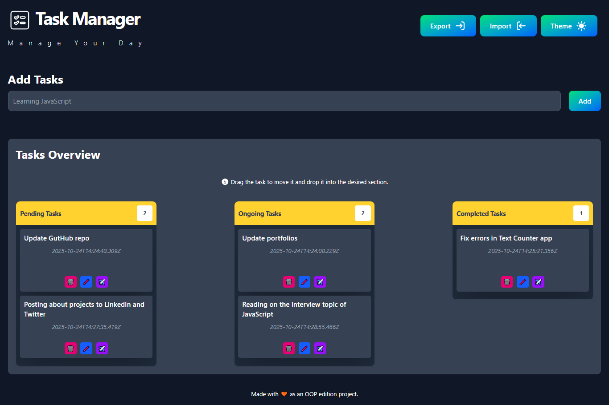
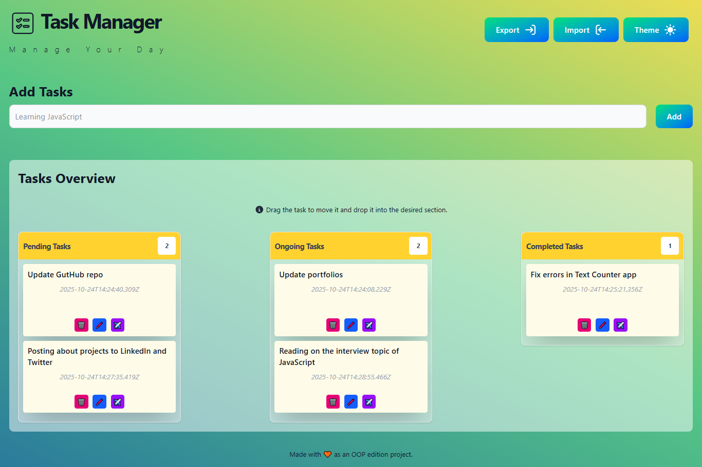

# Draggable Task Manager (OOP Edition)

## 🧠 What I Learned from Building a JavaScript Task Manager (OOP Edition)

Creating this task manager project was more than just writing code—it was a deep dive into the principles of clean architecture, modular design, and maintainable JavaScript. Here's what I gained from the experience:

### 🚀 Project Overview
I built a **Task Manager** using **Object-Oriented Programming (OOP)** in JavaScript. The goal was to manage tasks efficiently while keeping the codebase scalable and easy to maintain. This project helped me internalize key software engineering principles that go beyond syntax.

### 🧩 Key Learnings

- **Modularity & Separation of Concerns**  
  I structured the app into distinct modules—each responsible for a specific feature like task creation, filtering, and UI rendering. This made the codebase easier to navigate and debug.

- **Encapsulation & Reusability**  
  By using classes and encapsulating logic, I created reusable components that can be extended or modified without breaking other parts of the app.

- **Cleaner Architecture**  
  I avoid using messy code by organizing logic into well-defined methods and separating data handling from UI logic. This made the app more readable and less error-prone.

- **Maintainability & Scalability**  
  The modular design means I can now add features like due dates, priority levels, tasks group without major refactoring.

- **Event Handling & State Management**  
  I implemented custom event listeners and internal state tracking to ensure smooth user interactions and consistent UI updates.

### 🛠️ Tech Stack
- JavaScript (ES6+)
- HTML/Tailwindcss
- Object-Oriented Design Patterns

### 📂 Why This Matters
This project was a turning point in how I approach frontend development. It taught me that writing maintainable code is just as important as making things work. I now feel more confident building scalable apps and collaborating on larger codebases.

---

Feel free to check out the repo and explore the code. Feedback is welcome!

🔗 [GitHub Repository Link]  
📢 #JavaScript #OOP #FrontendDev #TaskManager #CleanCode #ModularDesign

---

 

  

 

 

